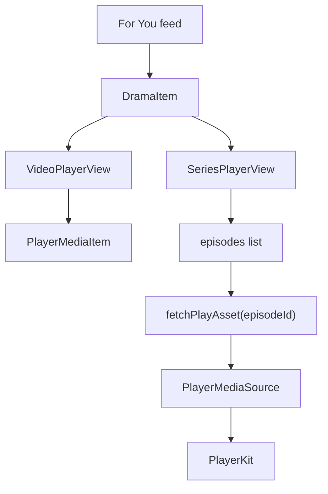

# Task26 For You + Player Design

日期：2026-06-22

## 目标

Task26 聚焦 RelaxShort iOS 的核心播放体验：`For You` 信息流和 `Series Player` 剧集播放器。目标是基于当前已跑通的真实后端接口，把 UI、交互状态和播放链路打磨到可对标 DramaBox 的程度。

最低目标：

- 视频真实播放稳定，不再出现 `about:blank`、无限 recovery、错误 URL 进入 AVPlayer。
- `For You` 首屏视觉接近参考截图，信息层级清晰，按钮不遮挡内容。
- 播放器控制层、剧集面板、倍速/清晰度/更多菜单具备完整可用状态。
- 真实接口字段不足时明确列出后端补齐项，不在 iOS 硬编码假业务。

## 参考截图

参考目录：

- `/Users/ethan/myspance/relaxshort/design-reference/dramabox/01_for_you`
- `/Users/ethan/myspance/relaxshort/design-reference/dramabox/07_seriseplay`

Task26 必须逐张核对这些状态：

- `play_normal.PNG`
- `click_screen_stop_UI.PNG`
- `long_press_screen_fast_forward_UI.PNG`
- `click_introduction.PNG`
- `click_title_dialog.PNG`
- `click_category_tag.PNG`
- `click_category_tag2.PNG`
- `click_collect_button.PNG`
- `click_collected_button.PNG`
- `click_share_button.PNG`
- `play_ui_show.PNG`
- `play_ui_hide.PNG`
- `click_episodes_button_default.PNG`
- `click_episodes_button_上拉.PNG`
- `speed.PNG`
- `quality.PNG`
- `三个点按钮.PNG`

## 范围

### 做

- 精修 `For You` 竖屏沉浸播放页。
- 精修 `Series Player` 剧集播放页。
- 补齐暂停、播放、长按快进、控制层显示/隐藏、剧集面板、倍速、清晰度、更多菜单等状态。
- 保持现有 PlayerKit 主链路，不重写播放器内核。
- 使用真实 `feed/for-you`、`episodes/{id}/play` 数据验证播放和字段映射。
- 必要时给后端补小字段或小接口，但只限支撑当前 UI 和真实联调。

### 不做

- 不做 StoreKit 真实购买。
- 不做 AdMob 激励奖励闭环。
- 不做 Home/Search/My List/Profile 页面重构。
- 不做生产登录鉴权重构。
- 不引入大规模新架构或重写 PlayerKit。

## iOS 主要改动面

优先检查和修改：

- `RelaxShort/Views/RecommendPage/VideoPlayerView.swift`
- `RelaxShort/Views/RecommendPage/SeriesPlayerView.swift`
- `RelaxShort/Views/Player/PlayerComponents.swift`
- `RelaxShort/PlayerKit/ShortVideoPlayerView.swift`
- `RelaxShort/PlayerKit/PlayerMediaModels.swift`
- `RelaxShort/Models/API/ForYouFeedResponseDTO.swift`
- `RelaxShort/Models/API/PlayerMediaSource.swift`
- `RelaxShort/Core/Services/RealHomeRepository.swift`
- `RelaxShort/Core/Services/RealDetailRepository.swift`

如果需要新增组件，应优先放在现有 `Views/RecommendPage` 或 `Views/Player` 边界内，避免跨页面散落。

## 后端主要核对面

优先只核对，不主动大改：

- `GET /api/v2/feed/for-you`
- `GET /api/v2/episodes/{episodeId}/play`
- V5/V6 dev MySQL seed 数据是否覆盖当前 smoke 剧集。

如果 iOS UI 需要字段但接口没有，应先记录为后端小补丁。例如：

- 剧集锁定状态。
- 是否已收藏。
- 分享奖励提示。
- 可用清晰度和当前清晰度。
- 字幕语言和默认字幕。

## 交互设计

### For You

- 默认进入全屏播放状态，视频铺满背景。
- 右侧操作栏包含头像/收藏/评论或更多/分享等，按钮尺寸和间距接近参考图，但避免遮挡字幕和底部标题。
- 底部信息区展示标题、简介摘要、分类 tag、集数/免费提示。
- 点击屏幕切换暂停态，暂停态显示中央播放按钮和轻量控制层。
- 长按进入快进反馈态，松手恢复播放。
- 点击标题或简介打开标题/简介弹层。
- 点击分类 tag 打开轻量列表或筛选入口；如果真实接口未具备筛选能力，先做可关闭弹层并列为后续 Home/Search 联动。
- 收藏按钮必须有已收藏/未收藏状态反馈；真实接口不足时先做本地状态，不声称已同步服务端。
- 分享按钮打开系统 share sheet 或项目已有分享弹层；奖励金币只展示当前文案，不发放真实奖励。

### Series Player

- 支持控制层显示和隐藏两种状态。
- 当前集信息、进度、返回、更多、剧集入口布局对齐参考图。
- 剧集按钮默认状态可直接打开剧集面板。
- 剧集上拉面板展示集数网格，当前集高亮，锁定/VIP/金币状态可见。
- 切集时必须使用 `RealDetailRepository.fetchPlayAsset()` 获取真实播放源，不使用旧 mock URL。

### 播放设置

- 更多菜单提供倍速、清晰度、字幕/反馈入口。
- 倍速面板支持常见档位：`0.75x`、`1.0x`、`1.25x`、`1.5x`、`2.0x`。
- 清晰度面板来自 `PlayerMediaSource.qualities`；没有多清晰度时显示当前源并禁用不可选项。
- 字幕入口读取 `subtitleTracks`；没有字幕时显示空态，不硬编码不可用语言。

## 数据流



关键约束：

- `DramaItem.videoURL` 只作为 feed 首播快速入口。
- 剧集切换必须以 `/episodes/{episodeId}/play` 返回的 `PlayerMediaSource` 为准。
- 不允许把无效 URL 降级为 `about:blank`。
- `compactMap` 跳过无 URL 卡片时必须避免播放器索引和 `dramas` 数组错位。

## 错误处理

- feed 卡片缺失播放 URL：不进入播放器池，打印明确诊断日志，并保持列表索引安全。
- play asset 拉取失败：显示可重试提示，不无限重建 AVPlayer。
- 清晰度/字幕为空：显示禁用态或空态，不崩溃。
- 网络失败：保留现有 recovery 上限，用户可手动重试。

## 验收

### 自动验证

在 iOS 仓库执行：

```bash
xcodebuild -project RelaxShort.xcodeproj -scheme RelaxShort -destination 'platform=iOS Simulator,name=iPhone 17' build
```

在后端仓库执行：

```bash
mvn test
curl 'http://127.0.0.1:8080/api/v2/feed/for-you?limit=3&content_language=en&country_code=GLOBAL'
```

### 手工 smoke

使用 Xcode 显式运行模拟器：

- `use_real_api=1`
- `api_base_url=http://127.0.0.1:8080`
- 后端 dev MySQL/Redis 已启动。

逐项检查：

- For You 首条视频可播放。
- 暂停/恢复正常。
- 长按快进反馈正常。
- 简介/标题弹窗正常打开关闭。
- 收藏状态可切换并有反馈。
- 分享入口可打开。
- 进入 Series Player 后可切换剧集。
- 剧集面板、倍速、清晰度、更多菜单可打开关闭。
- Xcode 控制台没有 `about:blank`、无限 `CoreMediaErrorDomain -12882`、无限 recovery。

## 交付物

- iOS 代码改动。
- 如需后端字段，则单独提交后端小补丁。
- `docs/TASK26_DELIVERY_REPORT.md`。
- Codex review 文档：`docs/CODEX_REVIEW_TASK26.md`。

## 风险

- 当前真实旧 SQL 媒资是 HTTP MP4，iOS 已允许直连播放；未来 CDN/HLS 标准化后需重新评估缓存策略。
- 收藏、分享、金币奖励如果没有真实后端接口，只能做 UI 和本地反馈，不能伪装成真实服务端状态。
- 对标 DramaBox 只能作为视觉和交互参考，文案、品牌、图标和素材不能直接照抄。
